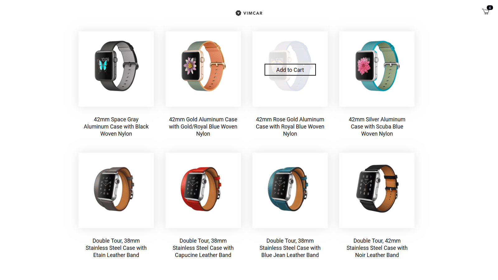

# Coding Challenge

An online shop built with React and styled with Scss.



## Run the project locally

1. Clone the repo
2. Install dependencies and run

```
yarn
yarn start
```

or

```
npm i
npm run start
```

## Features

- Responsive design
- When hovering over an image, the user sees if the product is available or not
- When available, the user can click on an item to add it to their cart
- The user can add as many items as they like
- The user sees the number of items added next to the cart logo
